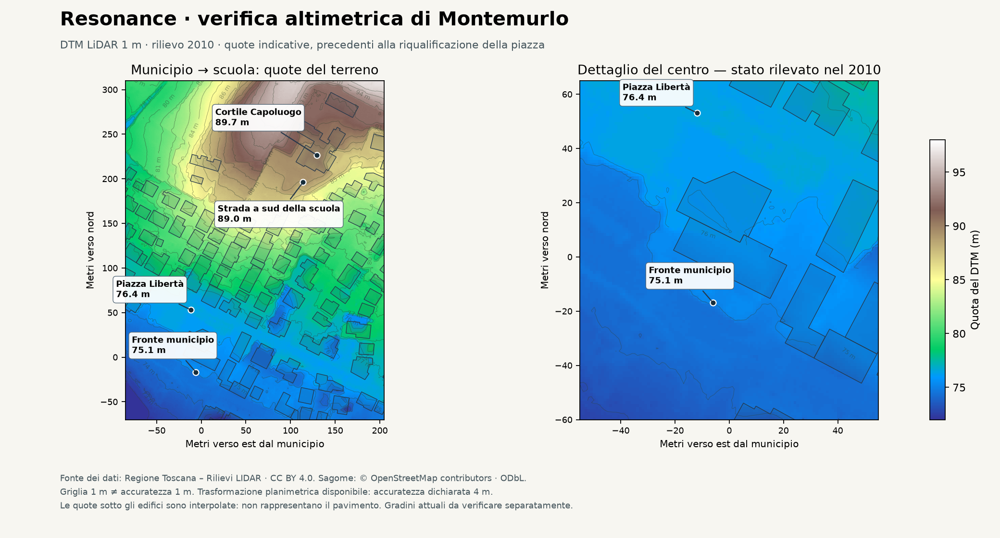
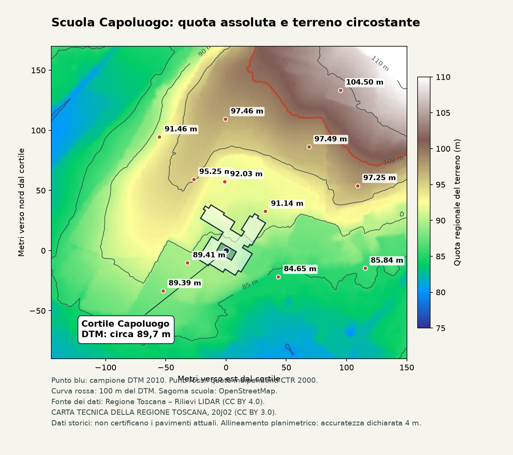

# Altimetria del centro di Montemurlo — verifica del 24 settembre 2026

## Risultato

Trovati, scaricati e campionati dati altimetrici reali per municipio e scuola Capoluogo. Il rilievo conferma circa 14,6 m di differenza tra i due punti campione, ma non è un rilievo aggiornato della piazza rinnovata. **Aggiornamento: il rilievo ora è integrato nel terreno della demo.** Vedi la verifica indipendente della scuola e i dettagli operativi qui sotto.

| Punto campione | Longitudine, latitudine | Quota DTM arrotondata | Intervallo nelle 9 celle vicine |
|---|---|---:|---:|
| Fronte municipio | 11.03689, 43.92705 | 75,1 m | 74,7–75,2 m |
| Piazza della Libertà | 11.03684, 43.92768 | 76,4 m | 76,4–76,5 m |
| Cortile interno scuola Capoluogo | 11.03865, 43.92921 | 89,7 m | 89,5–89,8 m |
| Strada a sud della scuola | 11.03845, 43.92894 | 89,0 m | 88,8–89,1 m |

Valori di celle del terreno del **2010**, non quote certificate dei pavimenti attuali. Gli intervalli descrivono variazioni spaziali, **non** l'incertezza della misura. I punti di municipio e piazza non sono gli estremi rilevati di una stessa scalinata: la loro differenza non va usata automaticamente per dimensionarla. Un primo campione esplorativo al centro della sagoma della scuola risultava 89,9 m: è stato sostituito qui da un punto nel cortile, perché il DTM sotto gli edifici interpola il terreno e non misura i pavimenti.

## Fonti effettivamente disponibili

1. [Catalogo LiDAR Regione Toscana](https://dati.toscana.it/it/dataset/lidar), interrogato tramite il servizio pubblico [Cartoteca WMS](https://www502.regione.toscana.it/geoscopio/servizi/wms/CARTOTECA.htm).
2. **DTM 1 × 1 m, anno 2010, lotto 004**, volo dal 27 giugno al 28 ottobre 2010, proprietario RT. Fogli **20j10** (municipio) e **20j02** (scuola). Dati effettivamente scaricati, non sola disponibilità nominale.
   - [20j10, archivio DTM](https://www502.regione.toscana.it/geoscopio/download/altimetria/lidar/dtm/20j10_1x1_dtm_004_2010_3003_55ab5ebbf31f588d91dfe650a3389b11.zip)
   - [20j02, archivio DTM](https://www502.regione.toscana.it/geoscopio/download/altimetria/lidar/dtm/20j02_1x1_dtm_004_2010_3003_2c01d7e3da97e08bd10fe1befba5dea5.zip)
3. **Licenza CC BY 4.0**, confermata anche dal PDF dentro gli archivi. Dicitura richiesta: «Fonte dei dati: Regione Toscana – Rilievi LIDAR». Non servono abbonamento o chiave API per questi download. Originali e licenza sono conservati in `sources/`.
4. Il catalogo restituisce anche **DSM fotogrammetrico 2021, elemento 263054, passo 1 m**, volo 20 luglio–21 agosto 2021. [Archivio indicizzato](https://www502.regione.toscana.it/geoscopio/download/altimetria/DSM_autocorrelazione_2021/DSM_263054.zip). Disponibilità verificata; raster **non scaricato né campionato**. Include superfici superiori, vegetazione e tetti: non sostituisce il DTM per il movimento. La scheda segnala verifiche di conformità incomplete. Licenza puntuale dell'archivio da verificare prima dell'integrazione.
5. Database topografico comunale **2009–2011** e CTR 1:2.000 **2000**, anch'essi indicizzati; non ancora estratti per muri, scarpate, punti quotati e scale. Non documentano da soli i lavori successivi.
6. Il [comunicato comunale dell'ottobre 2021](https://met.cittametropolitana.fi.it/news.aspx?n=343064) descrive l'avvio della pedonalizzazione di fronte al municipio. I DTM acquisiti precedono quindi la nuova sistemazione: servono riscontri successivi per le superfici costruite.

Non è stata dimostrata l'assenza di un rilievo più recente: questi sono i prodotti trovati con le interrogazioni eseguite. Non vanno generalizzati a tutta Italia o a tutta la Toscana.

## Metodo e limiti

- ASCII Grid georiferita in **EPSG:3003**, coordinate dei centri cella, passo 1 m. Le due tavole hanno una fascia di sovrapposizione, come documentato nella licenza.
- Trasformazione WGS84 → Monte Mario con pyproj/PROJ, senza trasformazioni approssimate non dichiarate. L'operazione disponibile dichiara **accuratezza planimetrica 4 m**; questo limite non è l'accuratezza verticale del LiDAR. Un allineamento più preciso richiede la trasformazione/griglia ufficiale appropriata o punti di controllo.
- Campionamento della cella più vicina e controllo delle nove celle adiacenti. Il numero di decimali nel file sorgente non garantisce precisione millimetrica. Non sono stati verificati i valori sul posto.
- Ritaglio nativo di 360 × 400 celle, senza ricampionamento, in `centre-dtm-2010.npz` (assi x/y EPSG:3003 e quote).
- Le quote regionali sono riferite al geoide secondo il documento sorgente; l'esatto riferimento verticale va confermato prima della fusione. Cesium `sampleTerrain` usa quote sopra l'ellissoide WGS84: **non si devono sostituire direttamente i numeri**. Occorre una trasformazione verticale/geoidica verificata. Un offset costante può servire solo come allineamento provvisorio locale, esplicitamente documentato.
- Le sagome sulla figura sono quelle OpenStreetMap già presenti nel progetto (© OpenStreetMap contributors, ODbL). Le sagome attuali non rendono attuale il rilievo altimetrico.

Riproduzione: Python con `numpy`, `pyproj`, `matplotlib`; eseguire `python scripts/analyse-elevation.py` dalla radice del progetto. Gli input sono gli archivi conservati in `sources/`. Gli output di questo primo script restano diagnostici. `scripts/build-terrain.py` produce invece i raster caricati dal gioco.

## Diagnosi precedente all’integrazione

La diagnosi sul codice è confermata: `src/civic.ts` adatta le pavimentazioni al terreno Cesium e posiziona ogni modello campionando il suo centro; `src/scene.ts` ricava la quota dei piedi dal terreno. Il server gestisce collisioni planimetriche, senza superfici calpestabili poste a quote diverse. Aggiungere solo scalini visivi lascerebbe quindi il robot a camminare sulla rampa sottostante.

Per una ricostruzione coerente:

1. Usare il DTM per l'andamento generale del quartiere, verificandone l'allineamento orizzontale e verticale. La scuola va posizionata sul suo terreno, senza applicarle la quota del municipio.
2. Individuare i limiti reali dei terrazzamenti: piazza bassa, piazza alta, accessi laterali al municipio, cortile della scuola, muri e rampe. Confrontare LiDAR, cartografia, fotografie recenti e tavole quotate dei lavori quando reperibili.
3. Modellare questi spazi come superfici costruite con quote controllate e piccole pendenze reali per lo scolo; non imporre una pendenza uniforme né appiattire indiscriminatamente tutta la piazza.
4. Sostituire localmente il suolo di rendering, evitando intersezioni con Cesium, e raccordarlo al terreno esterno. Modellare gradini, pianerottoli e muri solo dopo aver stabilito le quote e le posizioni di raccordo.
5. Usare le stesse superfici per personaggio, camera, arredi e validazione multiplayer. Impedire il passaggio attraverso i muri di contenimento; consentire scale e rampe. La camera può smorzare il movimento sui gradini senza cambiare la geometria visibile.
6. Verificare sul percorso municipio → accessi laterali → piazza alta → scuola, mantenendo l'unica modalità di gioco richiesta dall'utente.

Il metodo è realizzabile e riutilizzabile per nuove zone; l'individuazione automatica dei singoli gradini da una griglia a 1 m non è garantita. Mancano ancora le quote aggiornate e la geometria esatta dei raccordi post-ristrutturazione: non vengono presentate come già ricostruite.

## Google Elevation

La [documentazione ufficiale](https://developers.google.com/maps/documentation/elevation/overview) descrive quote per punti/profili, risoluzione e interpolazione. Il servizio può aiutare a controllare un andamento generale; la presenza di un valore di altitudine non dimostra la geometria di una scala, di un muro o di un pianerottolo. Per questo lavoro i raster regionali scaricabili sono una base più controllabile. Non sono state inviate richieste a pagamento a Google.

## Verifica aggiuntiva della scuola e integrazione del terreno

È stata estratta e campionata anche la **CTR 20J02, volo 2000**, distinta dal LiDAR 2010. [Archivio ufficiale utilizzato](https://www502.regione.toscana.it/geoscopio/download/ctr2k/SHP/S_20J02_2000_ctr2k_shp_1643567D932777BB8DF12779079148C7.zip). Il PDF incluso conferma **CC BY 3.0**, attribuzione **CARTA TECNICA DELLA REGIONE TOSCANA**. Dodici punti quotati sono conservati in `school-ctr-spots.geojson`.

| Riferimento CTR | Longitudine, latitudine WGS84 | Quota storica |
|---|---|---:|
| 2326, presso accesso scuola | 11.03824896, 43.92911808 | 89,41 m |
| 2352, lato nord-est | 11.03905693, 43.92950394 | 91,14 m |
| 2354, nord della scuola | 11.03863444, 43.92972477 | 92,03 m |
| 2348, pendio nord-ovest | 11.03831513, 43.92974235 | 95,25 m |
| 2362, più a monte | 11.03864190, 43.93019461 | 97,46 m |
| 2400, più a monte a est | 11.03950780, 43.92998585 | 97,49 m |

Questi dati sostengono la quota di circa 90 m presso il cortile, mentre l'area a monte raggiunge e supera 100 m. I precedenti 14,6 m erano il dislivello fra due punti specifici: non l'altitudine assoluta né la quota dell'intera proprietà scolastica. Lo screenshot dell'utente viene usato come indicazione da verificare, non come sorgente di un valore puntuale.

### Interventi eseguiti

- `scripts/build-terrain.py`: ricampionamento bilineare del DTM in griglia geografica di **565 × 635** campioni, circa 1 m, binario little-endian (717.550 byte), metadati e provenienza.
- `shared/elevation.mjs`: quote regionali e quote ellissoidiche separate, interpolazione, raccordo di 45 m ai bordi e controllo di attraversamento dei tratti ripidi.
- `src/terrain-provider.mjs`: provider composito Cesium; conserva le tile esterne e sostituisce quelle locali con heightmap 65 × 65 a dettaglio adattivo, fino al livello locale 19. Non crea un secondo suolo sovrapposto al globo. Nessuna chiamata remota per fotogramma.
- `src/scene.ts`, `src/civic.ts`: piedi e camera sulla superficie locale; arredi riposizionati; municipio ancorato al terreno presso l'ingresso. Sagome degli edifici ordinari all'interno del nucleo riassegnate alla nuova quota, con fondazioni e tetti orizzontali. Modelli fotografici del municipio e case approvate conservati. Facciate generiche procedurali, materiale condiviso per il raggruppamento dei disegni.
- Server: stesso raster e controlli sulle pendenze; nessun teletrasporto o quota inviata dal client. Restano le collisioni 2D delle sagome, senza simulazione di salti/cadute.
- Licenza e limiti disponibili anche nelle fonti della demo, senza nuovi pulsanti/modalità.

### Scelta verticale e limiti residui

Per questa integrazione si è applicata una **separazione EGM96 approssimata**, usando `us_nga_egm96_15.tif` distribuito da PROJ e l'operazione `vgridshift` con moltiplicatore +1. Nel cortile la separazione è circa **+45,024 m**: quota regionale circa 89,7 m → altezza ellissoidica circa 134,7 m. È una conversione del riferimento per Cesium, non un innalzamento fisico della scuola a 134,7 m sul mare.

Il geoide esatto del rilievo originale resta da identificare. Non si dichiara quindi una trasformazione geodetica certificata. Non è stato applicato un offset ricavato arbitrariamente dal municipio o dalle altezze degli edifici.

**Non sono stati ricostruiti come misurati i gradini attuali o i piazzali post-2020.** Il DTM conserva le forme storiche e interpola quelle più piccole della sua griglia. L'ancoraggio degli edifici è un adattamento grafico al terreno, non il rilievo dei loro pavimenti. Per completare questi dettagli servono riferimenti contemporanei con quote e limiti dei terrazzamenti: il lavoro presente risolve la base altimetrica, non sostituisce quei riscontri.

Riproduzione: `PYTHONPATH=/tmp/resonance-geodeps python3 scripts/build-terrain.py`; `scripts/plot-school-elevation.py` genera la nuova mappa (numpy, pyproj, pyshp, matplotlib). Le dipendenze temporanee possono essere installate anche in un normale ambiente virtuale.

### Validazione dell'integrazione

`npm run build` completato e **32 test** superati. I controlli aggiunti verificano quote presso punti CTR indipendenti, separazione geoidica/ellissoidica, continuità dei bordi, disponibilità dei livelli di dettaglio, raccordo con tile antenate, gestione della coda richieste e accessibilità della strada della scuola dal punto di spawn. Verifica nel browser su avvio, panoramica e ritorno al personaggio; ultima osservazione senza errori di rendering o streaming. Questi controlli software non sostituiscono un rilievo dei gradini attuali.

## Aggiornamento: scalinate approssimative

Su richiesta esplicita, aggiunte quattro scalinate percorribili con gradini, pianerottoli e cordoli. Si tratta di geometria approssimativa raccordata al rilievo, non di una certificazione dei gradini attuali. Le precedenti indicazioni sull’assenza di scalinate descrivono lo stato precedente a questo aggiornamento. Vedi [dettagli e controlli](STAIRS.md).
